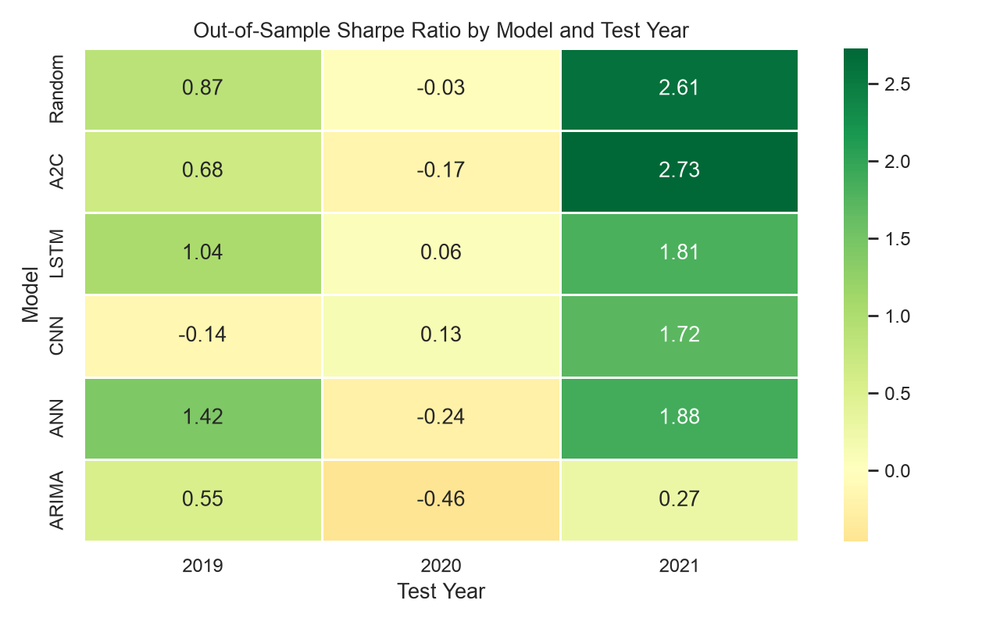
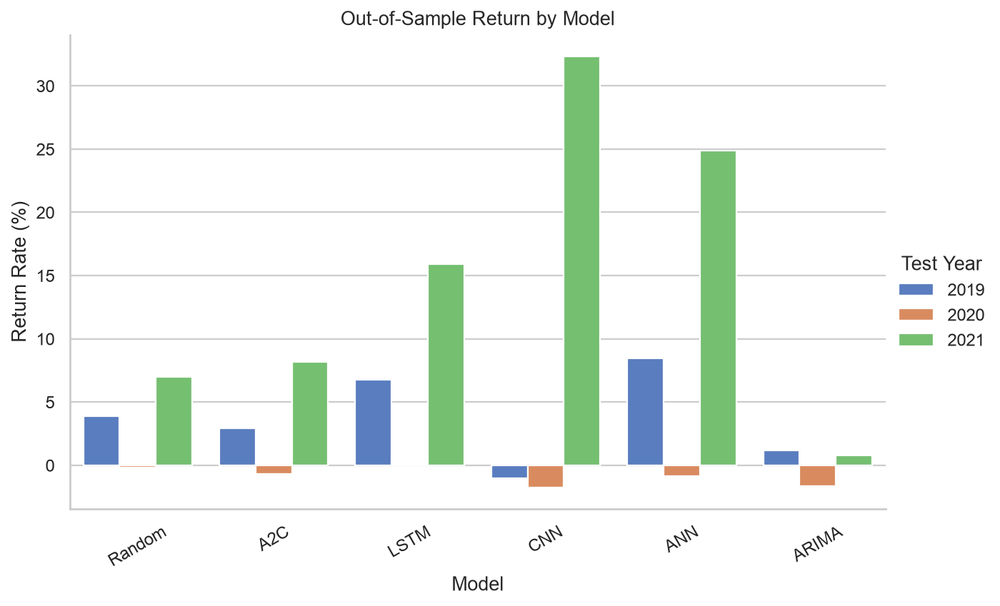
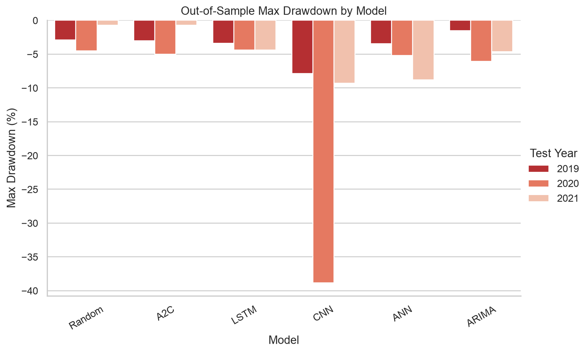
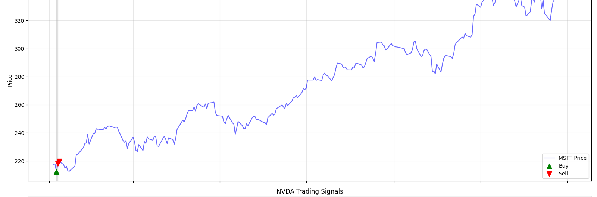

# Multi asset RL trading: model comparison

Part of [Quant Projects](https://github.com/AhmadKoman/Quant-Projects/tree/main/multi_asset_rl_trading).

I built this while trying to understand whether RL actually adds anything over simpler baselines on a multi asset portfolio. The setup is deliberately straightforward: 11 US equities, a discrete action space over buy/sell combinations, transaction costs, and walk forward evaluation so you're not just looking at in sample curve fitting.

Two versions of the same pipeline:

- **normal**: OHLCV plus a few derived quantities (returns, range, simple moving average ratios)
- **qtmrt**: same environment, but the state includes a full technical indicator panel (RSI, EMA/MACD, Ichimoku, Heikin Ashi, Bollinger bands, ATR, …)

Models in the comparison: random baseline, A2C, LSTM, CNN, ANN, and ARIMA. Each one gets a 10 year training window and is tested on the calendar year immediately after. I ran three OOS periods: 2019, 2020, 2021.

Universe: AAPL, MSFT, NVDA, JNJ, BAC, AXP, CVX, OXY, MRO, CCL, RCL. $10k starting capital, 5 bps per trade, 20 day lookback (25 for qtmrt), 1M training steps per model.

## Results (normal features)

These runs finished completely. Metrics are out of sample on the test year only.

**2019** (trained on 2009 to 2018)

| Model | Return (%) | Sharpe | Vol (%) | Max DD (%) |
|-------|-----------:|-------:|--------:|-----------:|
| Random | 3.88 | 0.87 | 4.92 | −2.90 |
| A2C | 2.91 | 0.68 | 4.79 | −3.02 |
| LSTM | 6.77 | 1.04 | 7.10 | −3.37 |
| CNN | −1.01 | −0.14 | 6.41 | −7.84 |
| ANN | **8.44** | **1.42** | 6.35 | −3.44 |
| ARIMA | 1.19 | 0.55 | 2.39 | −1.52 |

**2020** (trained on 2010 to 2019)

| Model | Return (%) | Sharpe | Vol (%) | Max DD (%) |
|-------|-----------:|-------:|--------:|-----------:|
| Random | −0.16 | −0.03 | 3.64 | −4.51 |
| A2C | −0.66 | −0.17 | 3.70 | −4.98 |
| LSTM | 0.13 | 0.06 | 3.65 | −4.38 |
| CNN | −1.75 | 0.13 | 36.43 | −38.83 |
| ANN | −0.87 | −0.24 | 3.71 | −5.20 |
| ARIMA | −1.64 | −0.46 | 3.72 | −6.09 |

**2021** (trained on 2011 to 2020)

| Model | Return (%) | Sharpe | Vol (%) | Max DD (%) |
|-------|-----------:|-------:|--------:|-----------:|
| Random | 6.99 | 2.61 | 2.83 | −0.70 |
| A2C | 8.17 | 2.73 | 3.14 | −0.69 |
| LSTM | 15.91 | 1.81 | 9.11 | −4.37 |
| CNN | **32.34** | 1.72 | 18.70 | −9.28 |
| ANN | 24.90 | 1.88 | 13.35 | −8.83 |
| ARIMA | 0.80 | 0.27 | 3.44 | −4.63 |

### A few things that stood out

Nothing wins every year, which is probably what you'd expect if the problem has any structure at all. 2019 looks like a case where a feedforward network (ANN) finds something the policy gradient method doesn't. A2C is noticeably worse on both return and Sharpe despite the same reward design.

2020 is the awkward year. Almost everything is flat or negative, and CNN blows up on volatility (36% vol, −39% drawdown) while still reporting a positive Sharpe, which is a good reminder that these scalar summaries can mislead when the return distribution is ugly. COVID broke a lot of stationarity assumptions; models trained on the prior decade weren't necessarily wrong to struggle.

2021 is where the deep models look impressive on return. CNN at +32%, ANN at +25%, but you pay for it in drawdown and vol. Random and A2C actually have *better* Sharpe ratios that year because they're taking less risk. So there's a familiar tradeoff: higher mean return vs. fatter tails. ARIMA stays boring throughout, low vol, low drawdown, mediocre return. As a baseline that's useful.

The action space is exponential in the number of assets (2^11 combinations), so there's a real exploration problem for RL here. I'm not convinced A2C is the right tool at this scale without more structure: hierarchical actions, factor constraints, something to shrink the effective policy space.

### Figures

Summary across the three test years:

Per run charts (equity curves, radar comparisons, training loss) are in `results/normal/test_2019`, `test_2020`, `test_2021`. The 2021 CNN equity curve (`results/normal/test_2021/cnn_strategy.png`) is worth looking at next to the 2020 CNN result if you want a sense of how unstable that architecture can be.

## QTMRT variant

Same pipeline with the richer feature set. These runs only got partway through. A2C and LSTM trained for all three years, but the full six model comparison didn't finish. Partial outputs are in `results/qtmrt/`.

One thing worth looking at is how the A2C agent actually trades once you give it the indicator panel. Below is MSFT from the 2021 test run: buy/sell markers on the price series during the out of sample window. Most of the action happens early in the year, then the policy goes quiet. That pattern showed up across assets, which makes me think the agent found a few positions it liked and then mostly stopped exploring. Hard to say if that's sensible risk management or just poor exploration in a huge action space.

Full chart: `results/qtmrt/test_2021/a2c_strategy.png`.
