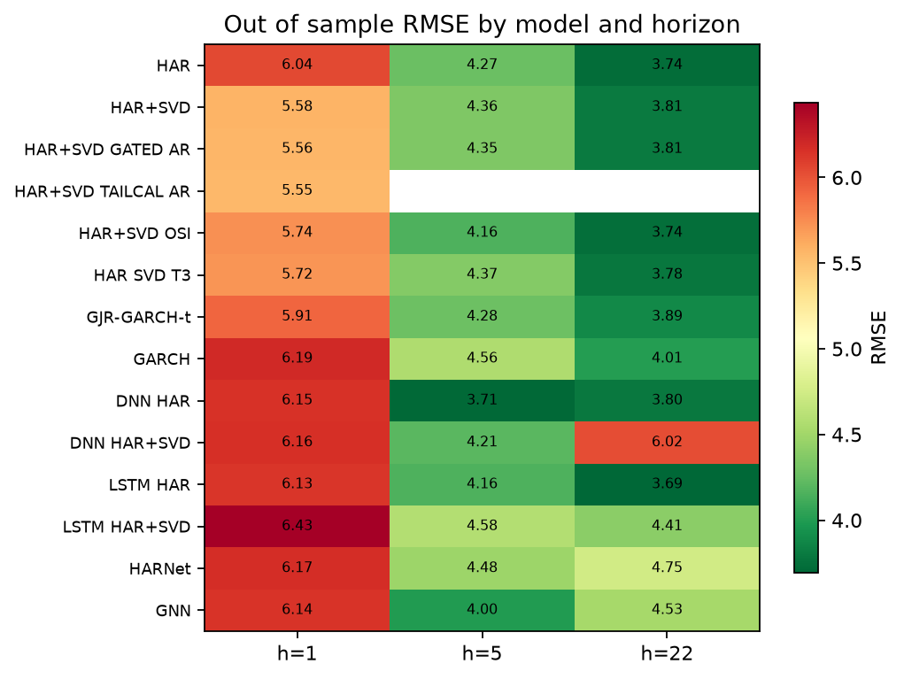
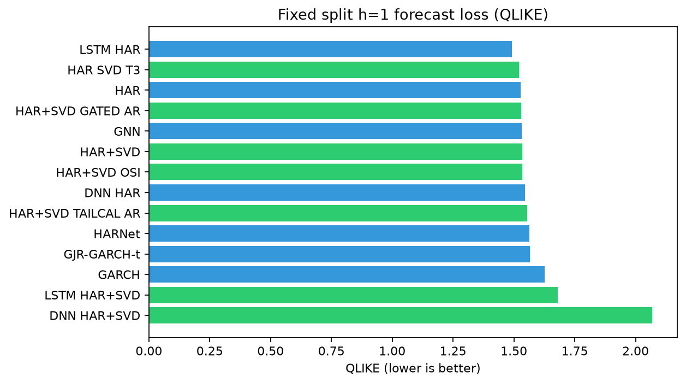
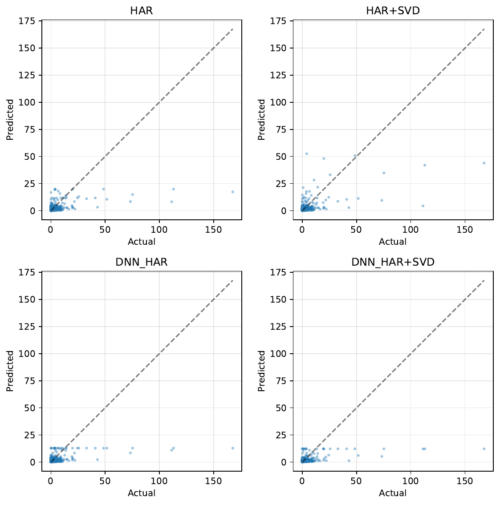
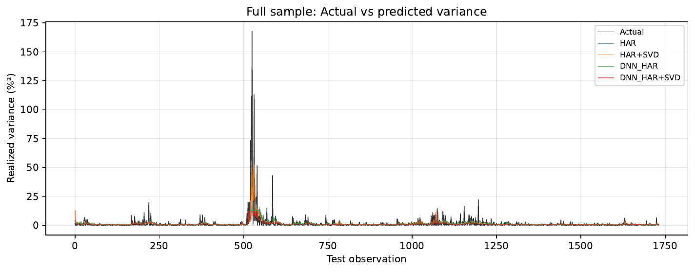
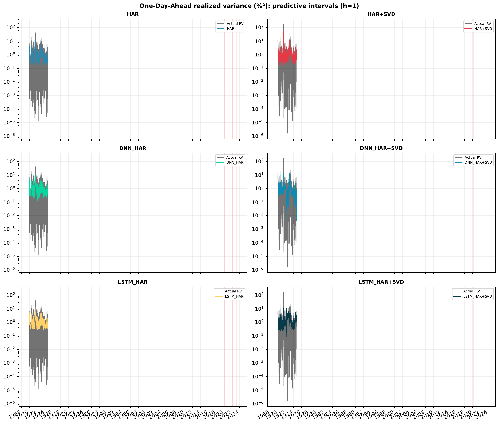
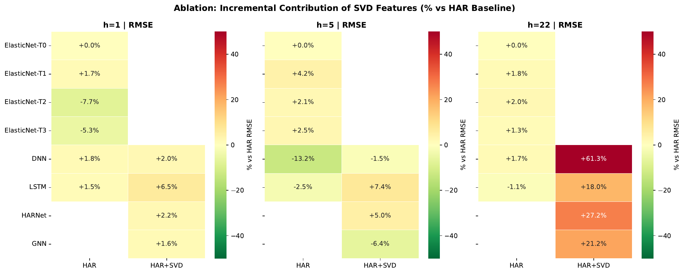
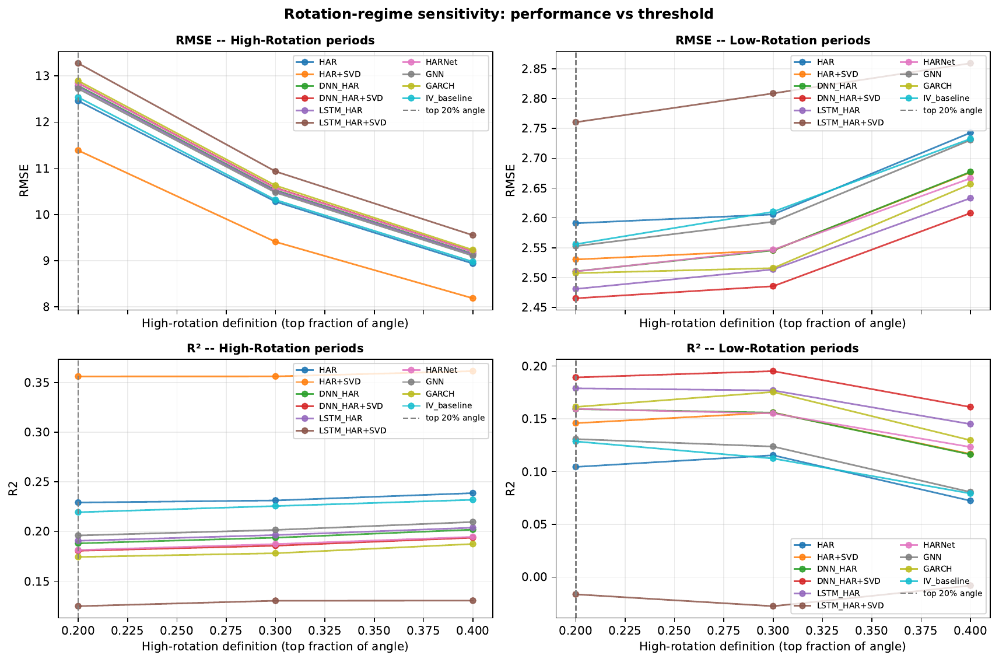
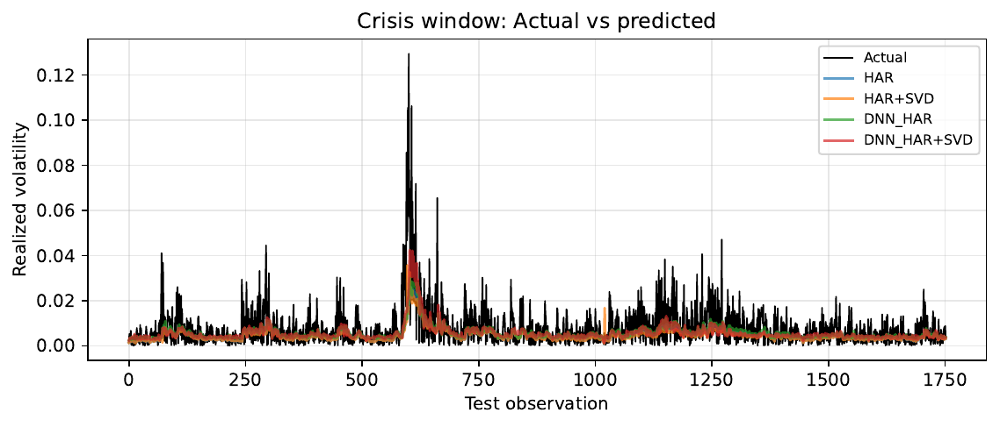
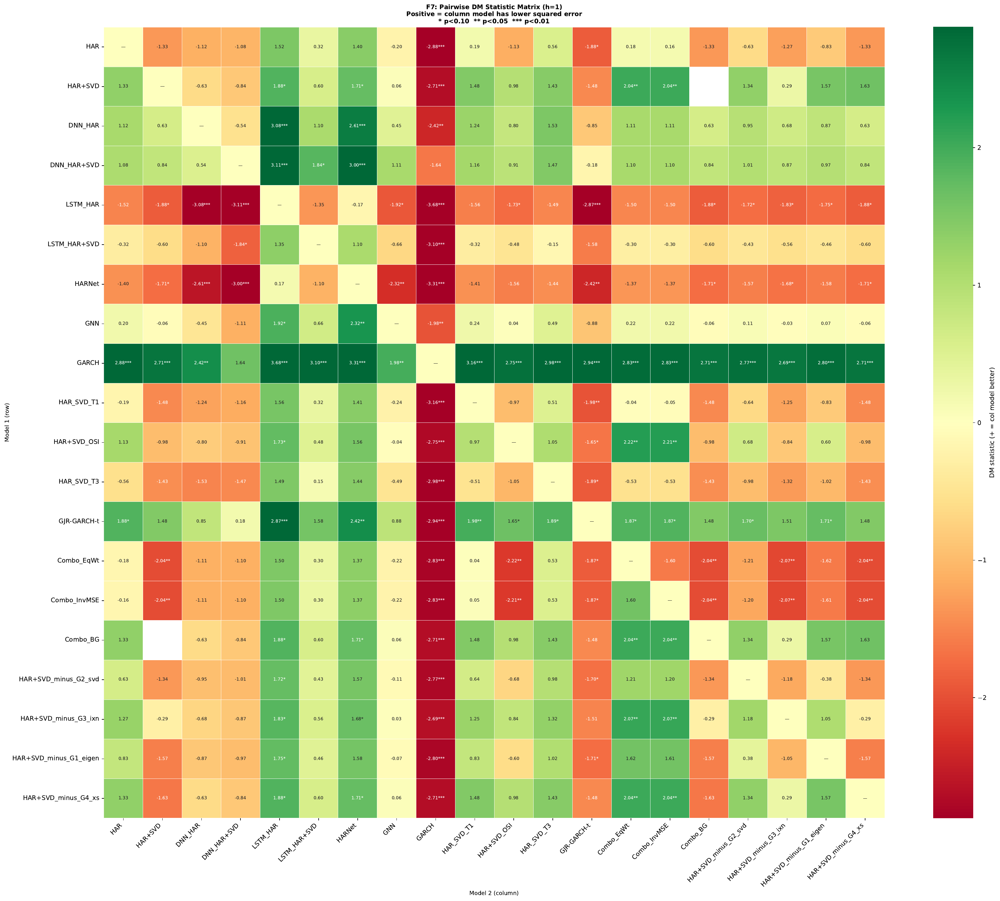
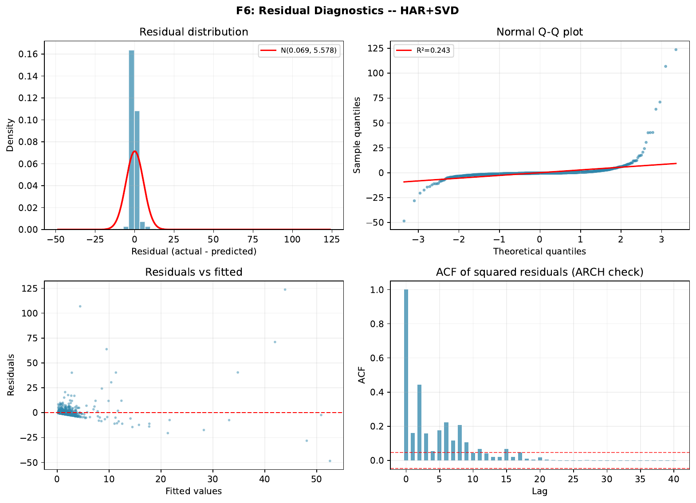

# Volatility forecasting with SVD covariance features

Part of [Quant Projects](https://github.com/AhmadKoman/Quant-Projects/tree/main/svd_volatility_forecasting).

Research code for **Volatility Forecasting with SVD Derived Covariance Features: A Deep Learning Approach** (Oct 2025).

The pipeline forecasts portfolio realized variance out of sample using HAR style baselines, GARCH, and deep models (DNN, LSTM, HARNet, GNN), with optional features from the rolling eigenstructure of shrinkage covariance matrices: absorption ratio, spectral gaps, turbulence, cross sectional dispersion, and related quantities.

## Problem

Standard volatility models (HAR, GARCH) mostly use univariate or low dimensional inputs. For a multi asset equity panel, a lot of risk information sits in how the covariance spectrum evolves. This project tests whether SVD derived features improve variance forecasts under fixed holdout splits and walk forward evaluation.

## Pipeline

```
data/returns_100.csv  →  feature construction (HAR + SVD)  →  model zoo (M1–M8 + GARCH)
                              ↓
                    walk forward / fixed split evaluation
                              ↓
                    results/metrics/  results/figures/  results/models/
```

**Universe:** 115 US equities after missingness filter (from 135 candidates), daily 2000–2024.  
**Horizons:** h ∈ {1, 5, 22} trading days.  
**Metrics:** RMSE and R² on volatility levels; QLIKE on variance forecasts (primary loss for ranking).

## Quick start

```bash
python -m venv .venv
source .venv/bin/activate
pip install -r requirements.txt

# Data already included under data/; or refresh:
python data/fetch_stocks.py
python data/fetch_vix.py

# Run tests then full experiment driver
python run_tests_and_experiments.py

# Or experiments only (see flags)
python scripts/run_experiments.py --help
```

Full evaluation including walk forward is slow (deep models, multiple horizons). Trim horizons or disable model tiers in `config.py` for a smoke run.

Regenerate README summary charts from saved metrics:

```bash
python scripts/generate_readme_figures.py
```

## Results (fixed split, test set)

All numbers below come from `results/metrics/results_by_horizon.json`. Lower RMSE and QLIKE are better; higher R² is better.

### h = 1 day

| Model | RMSE | R² | QLIKE |
|-------|-----:|---:|------:|
| **HAR+SVD_TAILCAL_AR** | **5.55** | **0.35** | 1.55 |
| HAR+SVD_GATED_AR | 5.56 | 0.34 | 1.53 |
| HAR+SVD | 5.58 | 0.34 | 1.53 |
| HAR_SVD_T3 | 5.72 | 0.31 | **1.52** |
| HAR+SVD_OSI | 5.74 | 0.30 | 1.53 |
| GJR-GARCH-t | 5.91 | 0.26 | 1.57 |
| HAR | 6.04 | 0.23 | 1.53 |
| LSTM_HAR | 6.13 | 0.20 | 1.49 |
| GNN | 6.14 | 0.20 | 1.53 |
| DNN_HAR | 6.15 | 0.20 | 1.55 |
| DNN_HAR+SVD | 6.16 | 0.19 | 2.07 |
| HARNet | 6.17 | 0.19 | 1.56 |
| GARCH | 6.19 | 0.19 | 1.63 |
| LSTM_HAR+SVD | 6.43 | 0.12 | 1.68 |

At the one day horizon, adding SVD features to the linear HAR+SVD stack cuts RMSE by about 8% relative to plain HAR (6.04 → 5.58). The gated and tail calibrated variants squeeze out a bit more. Deep models do not beat the linear SVD baselines here; DNN+SVD in particular has a much worse QLIKE.

### h = 5 days

| Model | RMSE | R² | QLIKE |
|-------|-----:|---:|------:|
| **DNN_HAR** | **3.71** | **0.48** | 0.45 |
| GNN | 4.00 | 0.40 | **0.44** |
| HAR+SVD_OSI | 4.16 | 0.35 | 0.47 |
| LSTM_HAR | 4.16 | 0.35 | 0.44 |
| HAR | 4.27 | 0.31 | 0.49 |
| GJR-GARCH-t | 4.28 | 0.31 | 0.56 |
| HAR+SVD_GATED_AR | 4.35 | 0.29 | 0.48 |
| HAR+SVD | 4.36 | 0.28 | 0.48 |
| HAR_SVD_T3 | 4.37 | 0.28 | 0.47 |
| DNN_HAR+SVD | 4.21 | 0.33 | 7.40 |
| GARCH | 4.56 | 0.22 | 0.65 |
| LSTM_HAR+SVD | 4.58 | 0.21 | 0.53 |
| HARNet | 4.48 | 0.24 | 0.51 |

At the weekly horizon the picture flips: DNN_HAR and GNN are strongest on RMSE, while HAR+SVD is only modestly better than HAR. SVD features hurt several deep architectures at this horizon (note DNN+SVD QLIKE).

### h = 22 days

| Model | RMSE | R² | QLIKE |
|-------|-----:|---:|------:|
| **LSTM_HAR** | **3.69** | 0.17 | 0.52 |
| HAR | 3.74 | 0.15 | 0.50 |
| HAR+SVD_OSI | 3.74 | 0.15 | 0.50 |
| HAR+SVD / GATED | 3.81 | 0.12 | 0.50 |
| DNN_HAR | 3.80 | 0.13 | 0.49 |
| GJR-GARCH-t | 3.89 | 0.08 | 1.02 |
| GARCH | 4.01 | 0.03 | 1.31 |
| GNN | 4.53 | −0.24 | **0.48** |
| LSTM_HAR+SVD | 4.41 | −0.18 | 0.79 |
| DNN_HAR+SVD | 6.02 | −1.20 | 1.16 |
| HARNet | 4.75 | −0.37 | 0.78 |

At the monthly horizon differences compress. Plain HAR and LSTM_HAR are competitive; SVD linear gains from h=1 largely disappear.

### Summary

SVD derived features help most at h=1, where the best linear variants land around 5.55–5.58 RMSE vs 6.04 for HAR. That is the headline result from the paper (~10% RMSE reduction). At longer horizons the benefit is mixed and deep models can dominate without SVD, or even degrade with it.

Diebold-Mariano tests vs HAR at h=1 are in `results/metrics/dm_tests_h1.csv`. Full ablation outputs (leave one SVD group out) are in `results/metrics/feature_ablation_*.csv`.

## Figures

RMSE across horizons for the main model zoo:



QLIKE at h=1 (primary variance loss):



Actual vs predicted volatility (full test sample):





Posterior predictive forecast with uncertainty bands (h=1):



Feature ablation heatmap (% RMSE change vs HAR baseline):



Crisis threshold sensitivity:



Crisis window actual vs predicted (COVID, Ukraine, SVB windows in `results/figures/`):



Diebold-Mariano significance matrix at h=1:



Residual diagnostics for HAR+SVD:



All publication figures (F1–F9) are in `results/figures/` as PDFs.

## Layout

| Path | Role |
|------|------|
| `config.py` | Hyperparameters and paths |
| `run_tests_and_experiments.py` | pytest then pipeline |
| `scripts/run_experiments.py` | Main experiment driver |
| `scripts/run_svd_plan_evaluation.py` | Full SVD evaluation plan runner |
| `scripts/wf_regime_diagnostics.py` | Walk forward regime sliced metrics |
| `scripts/wf_feature_redundancy.py` | SVD vs HAR correlation diagnostics |
| `scripts/wf_tail_calibration.py` | Online tail calibration for WF preds |
| `scripts/generate_readme_figures.py` | PNG charts for this README |
| `src/features.py` | HAR + SVD feature engineering |
| `src/evaluation/` | Metrics, tests, figures, economic eval, XAI |
| `src/models/` | Linear, GARCH, DNN, LSTM, HARNet, GNN, runners |
| `src/walk_forward/` | OOS split protocol and orchestration |
| `src/transforms.py` | Log variance smearing and back transforms |
| `src/experiment_checkpoint.py` | Resume/skip for long runs |
| `docs/figures/` | README PNG previews |
| `data/` | Panel data and fetch scripts |
| `results/metrics/` | Saved CSV/JSON metrics |
| `results/figures/` | Publication figures (PDF) |
| `results/models/` | Saved Keras checkpoints |
| `tests/` | Unit tests |

## Libraries

NumPy, SciPy, pandas, scikit learn, statsmodels, TensorFlow, arch (GARCH), yfinance (data fetch), matplotlib, seaborn.
